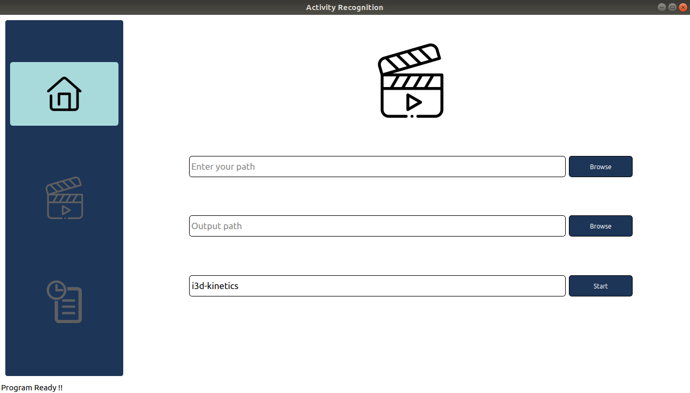
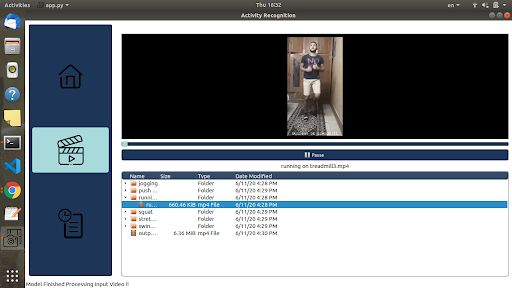
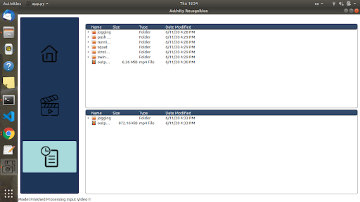

# Overview

Desktop application for video activity recognition that asks the user to input the long video path then the proposed algorithm is applied to make a tree folder that each folder contain small videos of the same actions that happened in that video.

### Algorithm

Original implementation found in this <a href='https://github.com/Nadern96/kinetics-i3d'> repository</a>

### install the application

make virtual environment, activate env, clone the repo and install requirments:
```
$ virtualenv env  
$ . env/bin/activate
$ git clone https://github.com/marina-fares/Activity_recognition_application.git
$ pip install -r requirements.txt
```
### user interface

You can add your video path and then waiting for the output videos<br/>
<br/><br/>
Here your output is ready<br/>
<br/><br/>
Finally you can see the history page for the provious videos<br/>
<br/>
